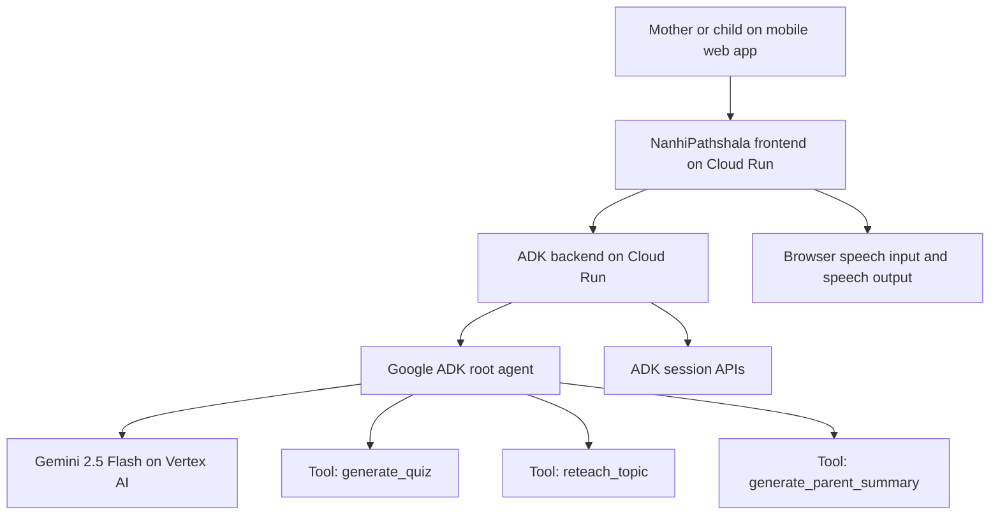

# Architecture

## Summary

NanhiPathshala is a Hindi-first tutoring agent built with Google ADK, powered by Gemini on Vertex AI, and deployed on Cloud Run.

## Google Cloud Flow

## Components

### Frontend

- Mobile-first React interface
- Hindi by default, English switch available
- Large controls for mothers and children
- Voice-first interaction area
- Parent summary card

### Backend

- Python service using Google ADK
- Single `root_agent` called `nanhipathshala_tutor`
- Session-aware API flow for repeat tutoring conversations
- Tool-backed responses for quiz, reteach, and parent summary workflows

### Model Layer

- `gemini-2.5-flash` on Vertex AI
- Fast enough for interactive tutoring
- Cost-efficient for MVP usage

### Deployment

- Frontend on Cloud Run
- Backend on Cloud Run
- Cloud Build used for source-based deployment

## Why This Is An Agent

NanhiPathshala is an agent because it has:

- a defined ADK root agent
- instructions and behavior policy
- callable tools
- session-based execution
- deployable runtime on Cloud Run

It does not need to be multi-agent to qualify for Track 1.
